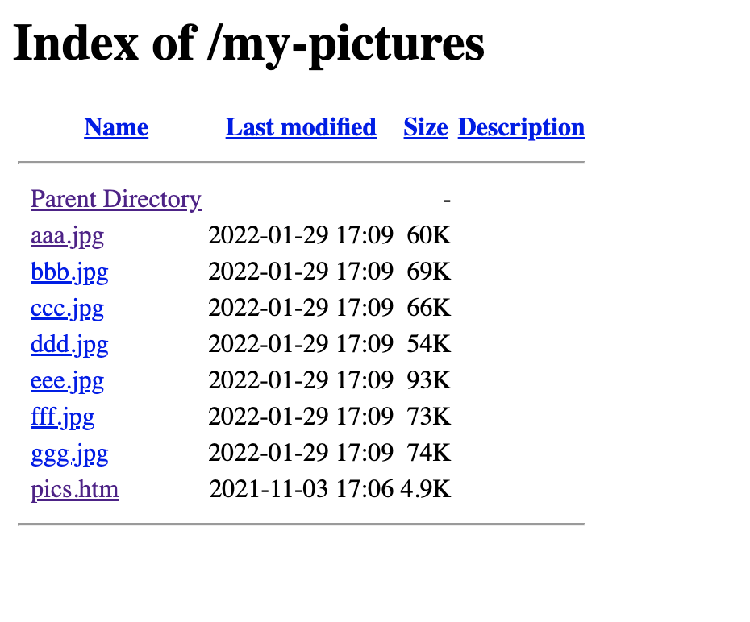
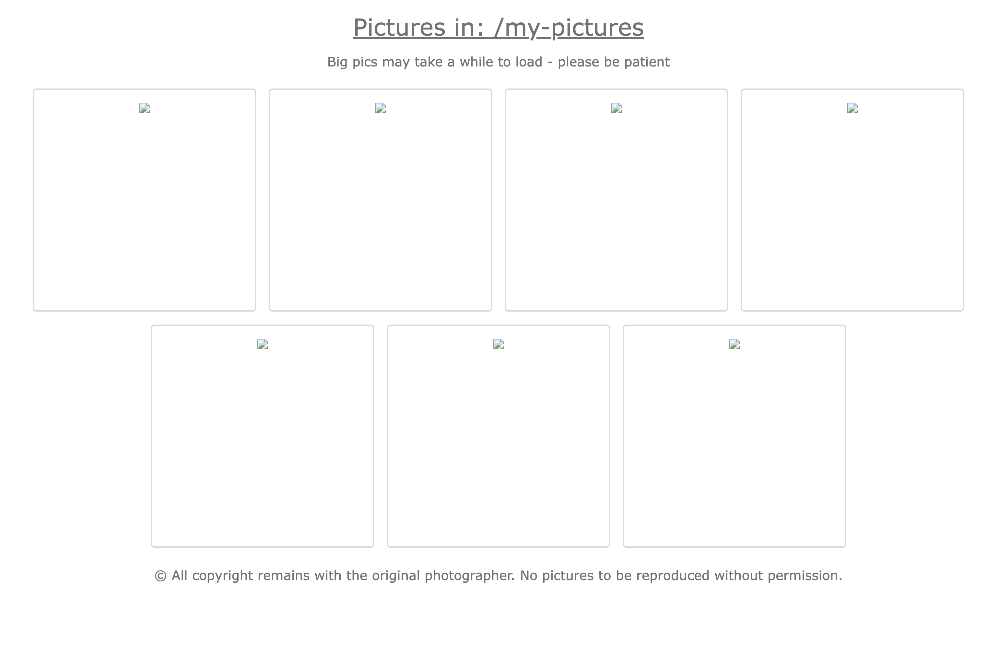

# pics

A system for displaying pictures from a File Server.

## Usage

Put the file next to your other files in your File Server and make them accessible via a browser, like such:



Resulting in a `domain.tld/my-pictures/pics.htm` looking something like:



---

This was built with the Apache HTTP Server in mind, where you can make a directory available by inserting a `.htaccess`
configuration file into the directory with the following configuration:

```htaccess
Options +Indexes
```

Read more about `Options` here: https://httpd.apache.org/docs/2.4/mod/core.html#options 
